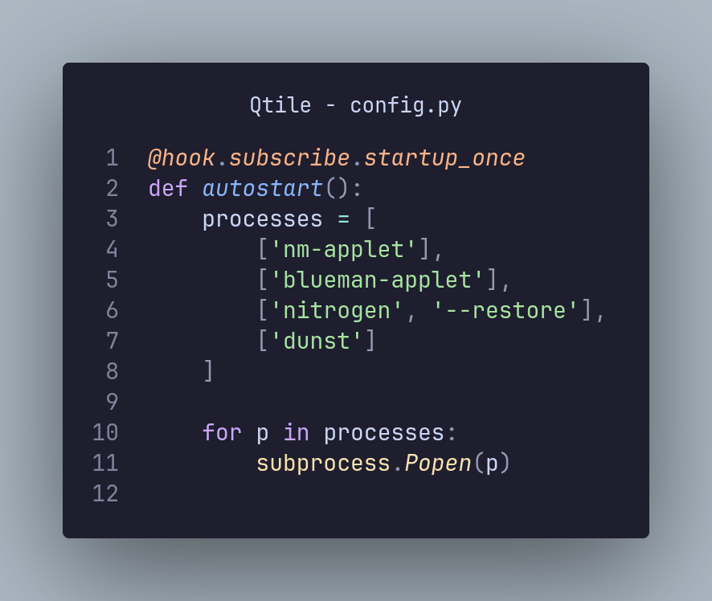
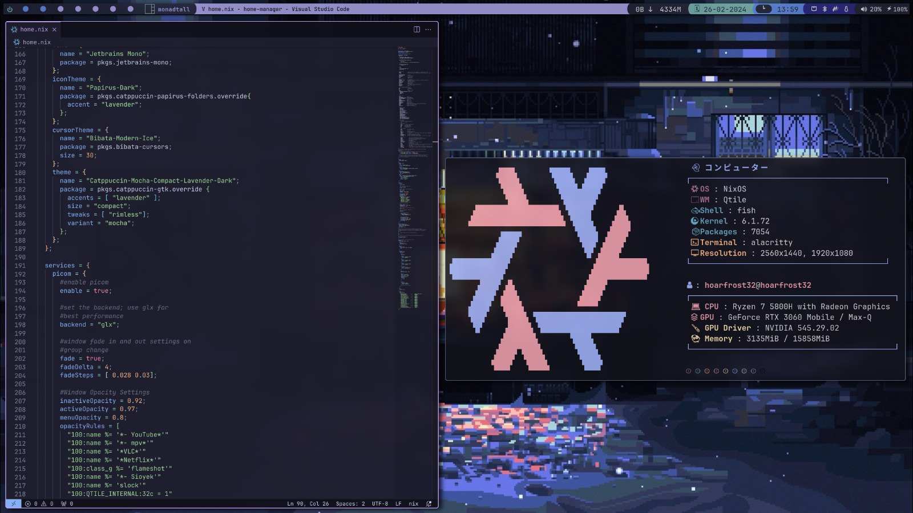
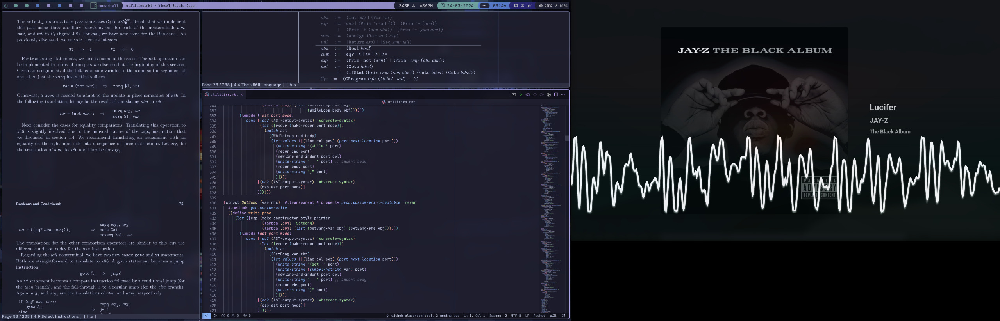
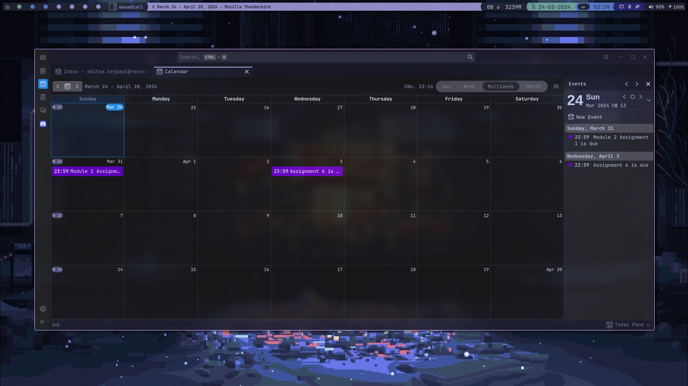
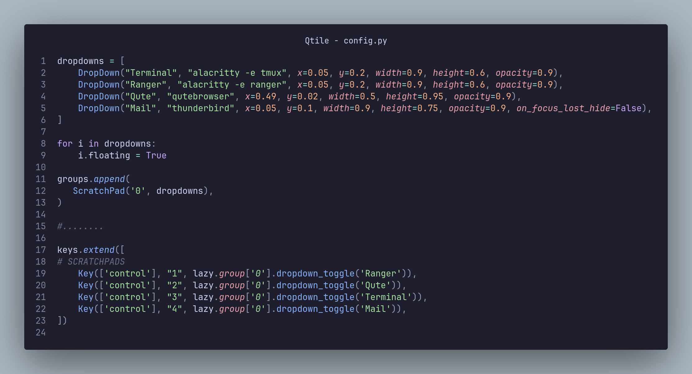
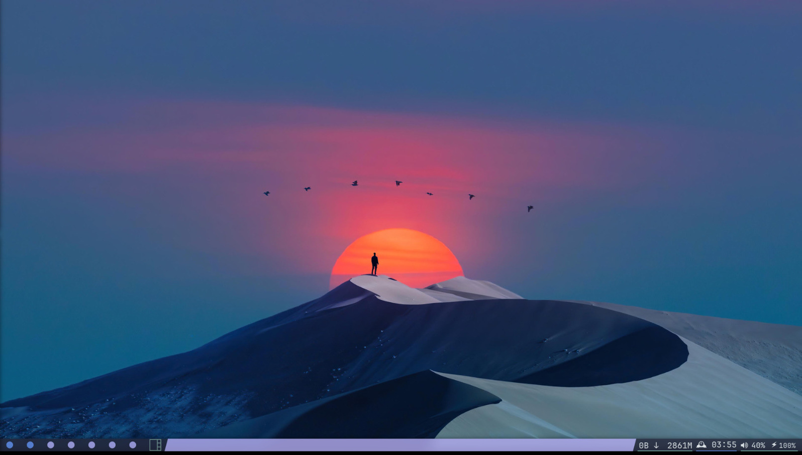

# 
My Qtile Config

QTile is a great window manager that (sort of) is an XMonad clone, except its written and configured in python, and is much more of a complete package with its own bar (and systray) and no plugins (though there are some extra widgets and styling options provided through qtile-extras which I do use). 

 

In the following code block, found in `config.py`, are the services I start whenever I boot up my system, in case any changes are needed to be made:

 

 

This is what the primary screen looks like in a multi-monitor setup (my neofetch config is taken from [here](https://github.com/prasanthrangan/hyprdots/tree/main)). The bar is aligned to the top and floating, and for all the other screens it is bottom aligned and not floating. The widget selection in that case is the same as when there is only a single monitor available. While the widgets are defined in the `.py` files in the Widgets folder, the bar selection and alignment is handled in `screens.py`.

 

 

 

Scratchpads are windows which remain always active in the background, and can be summoned at any time with a chosen keybind. They are bound to a single group in qtile. I have 4 scratchpad windows setup on my config-Thunderbird, Ranger (its the only file manager I use anymore), a shell instance with tmux, and qutebrowser. These are defined in `config.py`:

 

 

I would recommend setting up at least a shell window in a scratchpad. Thunderbird and Ranger have also been extremely helpful and useful in my case. 

 

This is what the bar looks like when there is only a single screen attached (and also what it looks like on all the secondary screens in a multi-screen setup).
